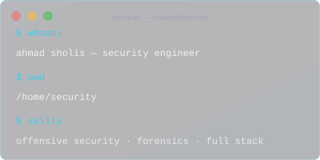

<!-- 
  ============================================
  AHMAD SHOLIS · SECURITY ENGINEER
  Premium Portfolio Profile
  ============================================
-->

<!-- BANNER -->

  

<!-- TYPING ANIMATION -->

  

<!-- DIVIDER -->

<!-- 
  ============================================
  ABOUT ME
  ============================================
-->

  <h3 style="color: #00D4FF; font-family: 'Segoe UI', Arial, sans-serif; font-weight: 300; letter-spacing: 3px; font-size: 12px; margin-bottom: 2px;">
    SYSTEM · PROFILE
  </h3>
  <h2 style="color: #FFFFFF; font-family: 'Segoe UI', Arial, sans-serif; font-weight: 300; font-size: 28px; margin-top: 4px;">
    About Me
  </h2>

<table align="center" style="border-collapse: collapse; border: none; max-width: 1000px; width: 100%; margin: 16px auto;">
  <tr>
    <td style="border: 1px solid rgba(0, 212, 255, 0.06); border-radius: 8px; padding: 32px; background: rgba(5, 8, 22, 0.6); vertical-align: top; width: 60%;">
      
      

        $ whoami
      

      
      

        Ahmad Sholis — Cyber Security Engineer
      

      
      

        Building secure systems and elegant solutions at the intersection 
        of security and development.
          
        ▸ 6+ years engineering experience
         
        ▸ 20+ security projects delivered
         
        ▸ 50+ vulnerabilities identified
      

      
      <!-- Quick Stats -->
      

        

          
Focus

          
🔒 Security Architecture

        

        

          
Status

          
● Active

        

      

      
    </td>
    
    <td style="border: none; padding-left: 24px; vertical-align: middle; width: 40%;">
      
    </td>
  </tr>
</table>

<!-- DIVIDER -->

<!-- 
  ============================================
  TECH STACK
  ============================================
-->

  <h3 style="color: #00D4FF; font-family: 'Segoe UI', Arial, sans-serif; font-weight: 300; letter-spacing: 3px; font-size: 12px; margin-bottom: 2px;">
    SYSTEM · TOOLKIT
  </h3>
  <h2 style="color: #FFFFFF; font-family: 'Segoe UI', Arial, sans-serif; font-weight: 300; font-size: 28px; margin-top: 4px;">
    Tech Stack
  </h2>

<table align="center" style="border-collapse: collapse; border: none; max-width: 1000px; width: 100%; margin: 16px auto;">
  <tr>
    <td style="border: 1px solid rgba(0, 212, 255, 0.06); border-radius: 6px; padding: 18px 22px; background: rgba(5, 8, 22, 0.6); width: 25%;">
      
🛡️

      
Security

      

        Kali · Metasploit · Wireshark 
        Burp Suite · Nmap · OWASP
      

    </td>
    
    <td style="border: 1px solid rgba(0, 212, 255, 0.06); border-radius: 6px; padding: 18px 22px; background: rgba(5, 8, 22, 0.6); width: 25%; margin-left: 12px;">
      
💻

      
Development

      

        PHP · Laravel · React · Node 
        Python · Go · TypeScript
      

    </td>
    
    <td style="border: 1px solid rgba(0, 212, 255, 0.06); border-radius: 6px; padding: 18px 22px; background: rgba(5, 8, 22, 0.6); width: 25%; margin-left: 12px;">
      
⚙️

      
Infrastructure

      

        Docker · Kubernetes · AWS 
        Linux · Nginx · CI/CD
      

    </td>
    
    <td style="border: 1px solid rgba(0, 212, 255, 0.06); border-radius: 6px; padding: 18px 22px; background: rgba(5, 8, 22, 0.6); width: 25%; margin-left: 12px;">
      
🎨

      
Creative

      

        Photoshop · Illustrator · Figma 
        Canva · Lightroom
      

    </td>
  </tr>
</table>

<!-- DIVIDER -->

<!-- 
  ============================================
  FEATURED PROJECTS
  ============================================
-->

  <h3 style="color: #00D4FF; font-family: 'Segoe UI', Arial, sans-serif; font-weight: 300; letter-spacing: 3px; font-size: 12px; margin-bottom: 2px;">
    SYSTEM · PROJECTS
  </h3>
  <h2 style="color: #FFFFFF; font-family: 'Segoe UI', Arial, sans-serif; font-weight: 300; font-size: 28px; margin-top: 4px;">
    Featured Work
  </h2>

<!-- Project Cards -->
<table align="center" style="border-collapse: collapse; border: none; max-width: 1000px; width: 100%; margin: 16px auto;">
  <tr>
    <!-- Project 1 -->
    <td style="border: 1px solid rgba(0, 212, 255, 0.06); border-radius: 8px; padding: 24px; background: rgba(5, 8, 22, 0.6); width: 33%; vertical-align: top;">
      
PROJECT_01

      
BPJS Bridge

      

        Healthcare integration platform serving 10,000+ patients with anti-duplicate system.
      

      

        Laravel
        React
        MySQL
      

      

        <a href="#" style="color: #00D4FF; font-family: 'Segoe UI', Arial, sans-serif; font-size: 12px; text-decoration: none; opacity: 0.6;">View Project →</a>
      

    </td>
    
    <!-- Project 2 -->
    <td style="border: 1px solid rgba(0, 212, 255, 0.06); border-radius: 8px; padding: 24px; background: rgba(5, 8, 22, 0.6); width: 33%; vertical-align: top; margin-left: 12px;">
      
PROJECT_02

      
RSQL

      

        Object-oriented SQL query builder with 50K+ monthly downloads and 1.2K stars.
      

      

        PHP
        SQL
        Composer
      

      

        <a href="#" style="color: #00D4FF; font-family: 'Segoe UI', Arial, sans-serif; font-size: 12px; text-decoration: none; opacity: 0.6;">View Project →</a>
      

    </td>
    
    <!-- Project 3 -->
    <td style="border: 1px solid rgba(0, 212, 255, 0.06); border-radius: 8px; padding: 24px; background: rgba(5, 8, 22, 0.6); width: 33%; vertical-align: top; margin-left: 12px;">
      
PROJECT_03

      
jualan

      

        Smart e-commerce platform with AI recommendations serving 500+ merchants.
      

      

        React
        Node
        MongoDB
      

      

        <a href="#" style="color: #00D4FF; font-family: 'Segoe UI', Arial, sans-serif; font-size: 12px; text-decoration: none; opacity: 0.6;">View Project →</a>
      

    </td>
  </tr>
</table>

<!-- DIVIDER -->

<!-- 
  ============================================
  GITHUB STATS
  ============================================
-->

  <h3 style="color: #00D4FF; font-family: 'Segoe UI', Arial, sans-serif; font-weight: 300; letter-spacing: 3px; font-size: 12px; margin-bottom: 2px;">
    SYSTEM · ANALYTICS
  </h3>
  <h2 style="color: #FFFFFF; font-family: 'Segoe UI', Arial, sans-serif; font-weight: 300; font-size: 28px; margin-top: 4px;">
    GitHub Metrics
  </h2>

  
  

 

  

<!-- DIVIDER -->

<!-- 
  ============================================
  INTERESTS
  ============================================
-->

  <h3 style="color: #00D4FF; font-family: 'Segoe UI', Arial, sans-serif; font-weight: 300; letter-spacing: 3px; font-size: 12px; margin-bottom: 2px;">
    SYSTEM · INTERESTS
  </h3>
  <h2 style="color: #FFFFFF; font-family: 'Segoe UI', Arial, sans-serif; font-weight: 300; font-size: 28px; margin-top: 4px;">
    Beyond Code
  </h2>

<table align="center" style="border-collapse: collapse; border: none; max-width: 800px; width: 100%; margin: 16px auto;">
  <tr>
    <td style="border: 1px solid rgba(0, 212, 255, 0.06); border-radius: 6px; padding: 14px 20px; background: rgba(5, 8, 22, 0.4); text-align: center;">
      📸
      
Photography

    </td>
    <td style="border: 1px solid rgba(0, 212, 255, 0.06); border-radius: 6px; padding: 14px 20px; background: rgba(5, 8, 22, 0.4); text-align: center; margin-left: 8px;">
      ⚡
      
Technology

    </td>
    <td style="border: 1px solid rgba(0, 212, 255, 0.06); border-radius: 6px; padding: 14px 20px; background: rgba(5, 8, 22, 0.4); text-align: center; margin-left: 8px;">
      🎨
      
UI Design

    </td>
    <td style="border: 1px solid rgba(0, 212, 255, 0.06); border-radius: 6px; padding: 14px 20px; background: rgba(5, 8, 22, 0.4); text-align: center; margin-left: 8px;">
      🤖
      
Automation

    </td>
  </tr>
</table>

<!-- DIVIDER -->
<img src="assets/divider.svg" width="100
