


 


 

**Cyber Security Engineer** based in Yogyakarta, Indonesia — I spend most of my time hardening systems, chasing down evidence in digital forensics work, and shipping full‑stack applications end to end.

My background sits at the intersection of three disciplines: securing infrastructure, building the software that runs on it, and designing the interfaces people actually see. That combination shapes how I work — code gets written with the same attention to detail as a security audit, and every interface gets the same care as a piece of visual design.

Outside of client and project work, I'm usually deep in a Linux terminal automating something that used to be manual, sketching out a more resilient system architecture, or out with a camera treating a scene the same way I'd treat a layout — for composition, light, and balance.

 

| | |
|---|---|
| **Role** | Cyber Security Engineer & Full Stack Developer |
| **Focus** | Digital Forensics · Secure Architecture · Automation |
| **Also into** | Visual Design · Photography |
| **Based in** | Yogyakarta, Indonesia |


 

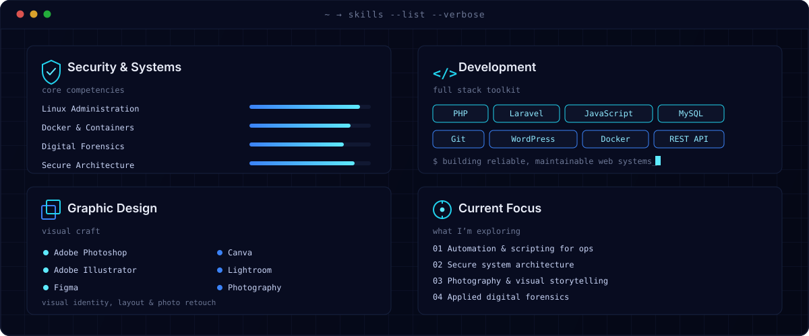


 

<table>
<tr>
<td width="33%">
</td>
<td width="33%">
</td>
<td width="33%">
</td>
</tr>
</table>

Cards above map to the categories I build in — swap in your own repositories by editing the three card SVGs or pinning repos further down.


 

<!--
  Top Languages widget was intentionally left out — it reflects whatever
  public repos exist on GitHub, which can look misleading (e.g. showing
  100% HTML) until real project repos are pushed. Add it back once you
  have a few representative repos public:
  

  If the live stats images above ever break again (shared free services
  occasionally go down or hit rate limits), swap this whole block for:
  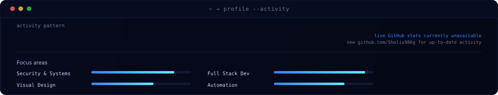
  It needs no external service and always renders.
-->


 

&nbsp;&nbsp;
&nbsp;&nbsp;
&nbsp;&nbsp;

Update the LinkedIn, Instagram and email links above with your own.

 


